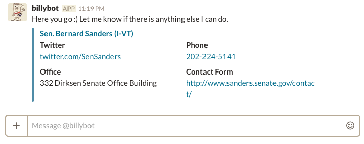

# billybot

A Slack bot for querying contact info for members of congress. 
Accepts variety of keyword queries and will present lists of partial matches and request additional information.

## Examples:

`@billybot Elizabeth` will find all members of congress named Elizabeth.

`@billybot 02138` will find all members of congress representing that zip code.

`@billybot California senate` will find both California senators.

`@billybot "West Virginia"` will find all representatives from West Virginia

`@billybot John D` will find all Democrats named John.

`@billybot John D house` will find all Democrats named John in the House.

`@billybot Bernie`:

* *(note that* `@billybot` *is not required when chatting via direct message)*
